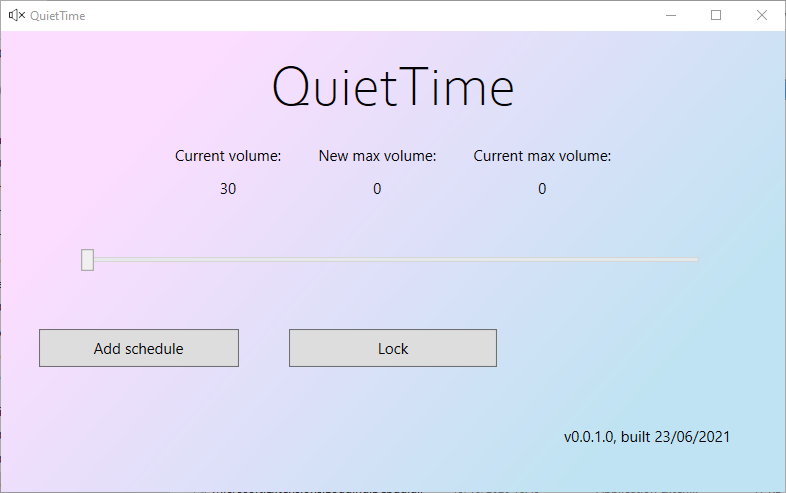

# QuietTime

Like [f.lux](https://justgetflux.com/) for your ears, QuietTime lets you cap your computer's maximum volume either on-command or according to schedules that you create.

You can use QuietTime to prevent long term hearing loss through over-exposure to loud sounds, or simply to make sure you don't accidentally blast out loud music in the evening hours.

## Features

* Lock your system's max volume to a reasonable level
* Create schedules with a defined start and end points:
  * Cap your max volume to 20% at 8PM, then set it to 60% at 9AM the next day
  * Cap your volume to 0% during working hours (like 9AM - 5PM), then set it to 100% during your free time
  * And any other possibilities you can think of!
* Schedules saved in simple, human-readable JSON format so you can tweak them by hand
* Will run in the background if closed (but can be shut down completely through the tray icon)

## Technologies

QuietTime is made with WPF and targets the .NET 6.0 runtime. It makes use of several NuGet packages:

* Autofac for dependency injection
* The Extended WPF Toolkit by Xceed for some user controls
* The Hardcodet NotifyIcon library for the tray icon
* Various Microsoft.Extensions libraries for configuration and logging
* The Microsoft MVVM Toolkit to help implement the MVVM design pattern
* NAudio by Mark Heath to interact with system audio
* NReco by Vitalii Fedorchenko for simple file-logging
* Quartz.NET by Marko Lahma for the scheduling framework back-end

## Credits

[Catalin Fertu](https://catalinfertu.com/) for the program icon.
