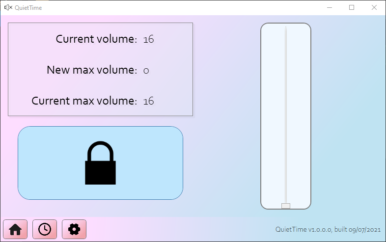

# QuietTime

Like [f.lux](https://justgetflux.com/) for your ears, QuietTime caps your computer's maximum volume.

Why use QuietTime?

* Your bluetooth headphones automatically set your volume way too high when you connect them
* You're worried about long-term hearing damage but forget to keep the volume low yourself
* You don't want to disturb other people with unexpectedly loud sounds from your PC

You can limit your system volume manually, or according to schedules that you create.

This program is inspired by [Quiet on the Set](https://github.com/troylar/quiet-on-the-set). I wanted to make an updated version in WPF, rather than Winforms, that included scheduling and a nicer UI.

## Features

* Lock your system's max volume
* Create schedules with defined start and end points: cap your volume to 20% at 8PM, then unlock it and set it to 60% at 9AM the next day
* Schedules and settings file saved in simple, human-readable JSON format you can tweak by hand
* Can start on Windows sign-in and run in the background silently

## Installation and usage

QuietTime doesn't need to be installed. Simply click the shortcut file to get started.

Your settings are saved in `usersettings.json`. By default, your saved schedules are in `schedules.json`. You can edit these files directly, but changes won't be reflected until you restart the program.

Many parts of the program have tooltips that give extra information when you hover your mouse over them. You can also right-click to see a context-menu with extra options in many cases.

## Technologies

QuietTime is made with WPF and targets the .NET 6.0 runtime (how exciting!). It uses several NuGet packages:

* The Extended WPF Toolkit by Xceed for some user controls
* The Hardcodet NotifyIcon library for the tray icon
* Microsoft.Extensions for dependency injection, configuration and logging
* The Microsoft MVVM Toolkit
* NAudio by Mark Heath for system audio
* NReco by Vitalii Fedorchenko for simple file-logging
* Quartz.NET by Marko Lahma for scheduling

## Issues and future goals

The slider on the main screen is very ugly. I'm planning to change it once I figure out control templates in WPF.

The program has essentially no unit tests.

Once I get more comfortable with GitHub Actions I'd like to automate releases.

I'm interested in adding more options for accessibility, such as a high-contrast mode and screen-reader automation for custom controls.

I plan to make QuietTime open for localization into other languages.

I have only tested QuietTime on my personal set-up. Please let me know if something doesn't work on your system!

## Contributing

Please see CONTRIBUTING.md and ARCHITECTURE.md in the `docs` folder.

## Credits

[Quiet on the Set](https://github.com/troylar/quiet-on-the-set) for initial inspiration.

Icons by:

* [icon king1](https://freeicons.io/profile/3)
* [www.wishforge.games](https://freeicons.io/profile/2257)
* [Raj Dev](https://freeicons.io/profile/714)
* [Catalin Fertu](https://catalinfertu.com/)